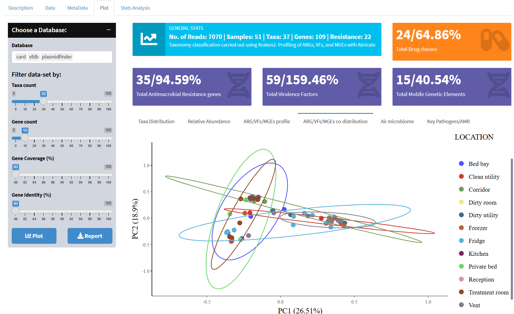

# hosMicro
Welcome to our R Shiny application! This interactive and user-friendly web application is designed to explore the hospital microbiome and genetic makeup in depth. Our tool provides a comprehensive platform for researchers, clinicians, and bioinformaticians to analyze and visualize metagenomics data with ease.

## Key Features:
- Hospital Microbiome: Gain insights into the microbiome specific to hospital settings and its impact on patient health.
- Pathogen Identification: Identify and study various pathogens present in hospital environments.
- Antimicrobial Resistance: Investigate antimicrobial resistance patterns and their implications for public health.
- Virulence Factors: Analyze virulence factors to understand the mechanisms of pathogenicity.
- Mobile Genetic Elements: Explore the role of mobile genetic elements in the spread of resistance and virulence factors.

We hope this application will be a valuable resource for your research and help advance our understanding of the hospital microbiome and its genetic components.



## Quick start
If docker is available, pull the image and run the Shiny app using the following commands:
```Sh
docker pull julio92ont/hosmicro:1.1.2

docker run --rm -p 3838:3838 -v /root/shiny_save julio92ont/hosmicro:1.1.2 R -e "shiny::runApp('/root/shiny_save', host='0.0.0.0', port=3838)"
```

## Installation
If installing from the source, an  R version >= 4.1.0 with the corresponding packages listed below is required. Most of these are easy to install on a linux-based system:
```Sh
### Clone the repository and move to the hosMicro directory
git clone https://github.com/Julio92-C/hosMicro.git
cd hosMicro

### Install packages and dependencies
sudo apt update
sudo apt install r-base
R --version
R -e "install.packages(pkgs=c('shiny','shinydashboard', 'shinydashboardPlus', 'DT', 'dplyr', 'plotly', 'readr', 'ggplot2', 'scales', 'forcats','thematic', 'gtsummary', 'paletteer', 'reshape2', 'tidyr', 'VennDiagram', 'tidyverse', 'stringr', 'ggsignif', 'vegan', 'circlize', 'pheatmap'), repos='https://cran.rstudio.com/')"

### Run the shiny app
R -e "shiny::runApp('.', host='0.0.0.0', port=3838)"
```

## Tutorial
If you need to get familiar with the app functionality, you can watch the 【![tutorial.]https://i9.ytimg.com/vi_webp/9njf0_LXSOI/mqdefault.webp?v=677a6bb7&sqp=CJCY8LsG&rs=AOn4CLCGfXGeEaoALSRDrE5XBgTviFcTPQ】(https://www.youtube.com/watch?v=v=9njf0_LXSOI)

## Acknowledgments:
We want to express our gratitude to our colleague, Dr. C. Oscar Previtali, for his support in curating the essential dataset for this application. We also want to thank our supervisors, Prof. Hermine V. Mkrtchyan, Dr. Piotr Cuber, and Dr. Raju Misra, for their invaluable contributions and guidance throughout the project. Your expertise has been crucial in enhancing our understanding and implementation of the metagenomics bioinformatics pipeline. We are truly thankful for everything you have done.

# Author:
Julio C. Ortega Cambara 

PhD C. Bioinformatics

School of Biomedical Sciences

University of West London

St Mary's Rd, London W5 5RF
  
