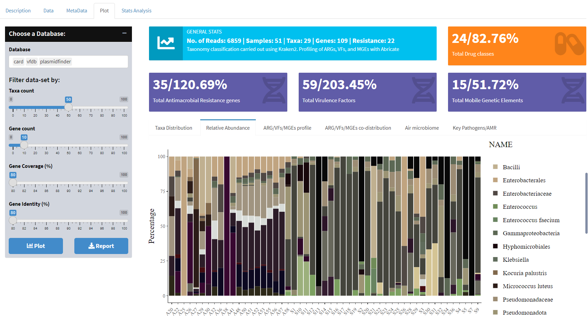

# hosMicro
The spread of antimicrobial-resistant bacteria globally is a pressing issue that has captured my attention.

- It's concerning to see how certain bacteria are becoming resistant to the drugs we use to treat them, leading to the rise of difficult-to-control superbugs.
- In 2017, the WHO published a list of priority pathogens including antibiotic-resistant bacteria, that were identified as high priority for new antibiotic development.
- In 2019, nearly 1.3 million deaths, including 140,000 newborns, were caused by antimicrobial resistance (AMR). This number is expected to rise to 10 million deaths by 2050.
- By understanding the patterns and drivers of antimicrobial resistance, we can create strategies to prevent its spread and enhance patient outcomes.



## Quick start
If docker is available, pull the image and run the Shiny app using the following command:
```Sh
docker run --rm -p 3838:3838 -v /root/shiny_save julio92ont/hosmicro:1.1.2 R -e "shiny::runApp('/root/shiny_save', host='0.0.0.0', port=3838)"
```

## Installation
If installing from the source, an  R version >= 4.1.0 with the corresponding packages listed above is required. Most of these are easy to install on a linux-based system:
```Sh
### Clone the repository and move to the hosMicro directory
git clone https://github.com/Julio92-C/hosMicro.git
cd hosMicro

### Install packages and dependencies
sudo apt update
sudo apt install r-base
R --version
R -e "install.packages(pkgs=c('shiny','shinydashboard', 'shinydashboardPlus', 'DT', 'dplyr', 'plotly', 'readr', 'ggplot2', 'scales', 'forcats','thematic', 'gtsummary', 'paletteer', 'reshape2', 'tidyr', 'VennDiagram', 'tidyverse', 'stringr', 'ggsignif', 'vegan', 'circlize', 'pheatmap'), repos='https://cran.rstudio.com/')"

### Run the shiny app
R -e "shiny::runApp('.', host='0.0.0.0', port=3838)"
```

## Features:

This web-based application has been developed to facilitate the exploration of the hospital microbiome.

The application is designed to provide a user-friendly interface for researchers and clinicians to analyze and visualize the metagenomic data generated from the hospital environment.

It offers a range of tools and features to help users identify taxonomy, track the spread of the pathogen, and understand their AMR, VFs, and MGEs profiles.

# Author:
Julio C. Ortega Cambara 

PhD C. Bioinformatics

School of Biomedical Sciences

University of West London

St Mary's Rd, London W5 5RF
  
